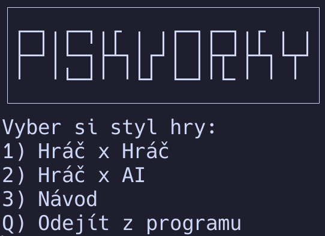
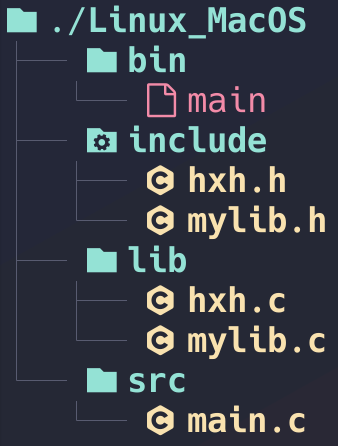

# VUT PROJEKT - PIŠKVORKY V C
Hodnocení projektu:  20/20
## AUTOŘI:
**Simon Veselý** - 271017<br>
**Vojtěch Šafář** - 270292
## O projektu:
1. **Grafické rozhraní hry:**

(vlozit jeste hlavni obrazovku hry, s těma políčkama)
<br>- Jedná se o TUI aplikaci
<br><br><br>

**Struktura projektu:**

1. Linux/MacOS


<br>

**Spuštění hry:**
<br>
1. Windows

Na Windows otevřeme project ve IDE Visual Studio 2022 a spustíme, jedná se o normální CMakeProject
<br>
2. Linux/MacOS
   
Pro Linux/MacOS lze samostatně kompilovat main.c, a poté jej spustit v terminálu
```
gcc -Iinclude src/main.c lib/mylib.c lib/hxh.c lib/checker.c lib/leaderboard.c lib/cJSON.c -o bin/main
./bin/main
```
<br>

**Výběr herních módů:**
<br>
1. Jakmile hru spustíme, vyskočí na nás okno s výběrem stylu hry
2. K dispozici jsou 2 herní režimy: Hráč proti hráči
                                    Hráč proti AI

3. Zobrazení návodu

4. Jako čtvrtá možnost je zde vypnutí hry
<br>

**Styly hry:**

1. Jako první styl hry je zde Hráč proti Hráči
   
   Uživatel si na začátku bude muset zvolit jméno a poté se mu otevře hra

   Tento styl hry funguje pomocí loopu s proměnnou if, else
<br>

2. Jako druhý styl hry je zde Hráč proti AI
<br>

3. Vypsání nejlepších hráčů

   Hráči se zobrazí žebříček nejlepších hráčů, skóre udává počet celkových výher hráče<br> - Databáze hráčů je uložená ve složce /Data jako .json soubor
4. Ukončení aplikace
   Hra se po zvolení této možnosti vypne


